# Lab #02,20110431, Tang Tam Nhu, INSE331280E_03FIE

# Task 1: Firewall configuration 
**Question 1**: 
Setup a set of vms/containers in a network configuration of 2 subnets (1,2) with a router forwarding traffic between them. Relevant services are also required:
- The router is initially can not route traffic between subnets
- PC0 on subnet 1 serves as a web server on subnet 1
- PC1,PC2 on subnet 2 acts as client workstations on subnet 2 
**Answer 1**:

**Question 2**:
- Enable packet forwarding on the router.
- Deface the webserver's home page with ssh connection on PC1
**Answer 2**:

**Question 3**:
  Config the router to block ssh to web server from PC1, leaving ssh/web access normally for all other hosts from subnet 1.   

**Answer 3**:

**Question 4**:
- PC1 now servers as a UDP server, make sure that it can reply UDP ping from other hosts on both subnets.
- Config personal firewall on PC1 to block UDP accesses from PC2 while leaving UDP access from the server intact.
**Answer 4**:

# Task 2: Encrypting large message 
Use PC0 and PC2 for this lab 
Create a text file at least 56 bytes on PC2 this file will be sent encrypted to PC0
- I will use CMD on Windows as a PC0(Receiving computer) and WSL as a PC2(Sending computer)
- Thus, I create a plaintext.txt file with the content "This is a sample text for AES encryption testing purposes." via WSL as below. To verify the file size (must be ≥ 56 bytes), we use the wc command and we have 59 bytes on plaintext
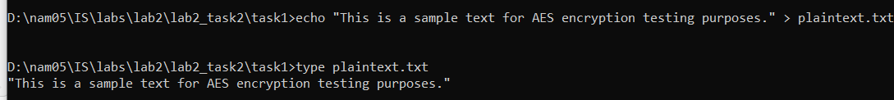

**Question 1**:
Encrypt the file with aes-cipher in CTR and OFB modes. How do you evaluate both cipher in terms of error propagation and adjacent plaintext blocks are concerned. 
- Next, we will create a AES 256-bit key and IV (Initialization Vector) 128-bit as below and use the ls command to check the existence of the key file or not
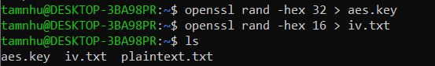
- Encrypt the plaintext file with OFB mode and CTR mode and Encrypt the plaintext file with OFB mode and CTR mode and save it into the file named encrypted_ofb.bin and encrypted_ctr.bin, respectively:
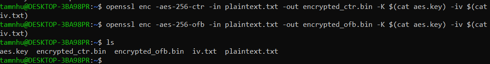
- We will then create checksum to check the integrity of OFB and CTR encrypted files named encrypted_ofb.sha256 and encrypted_ctr.sha256, respectively
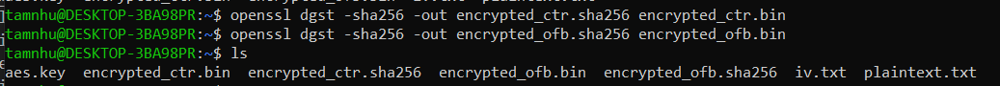
- In the next step, we move files through shared folders between WSL and Windows (PC2 to PC0) by below command
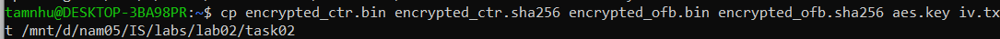
- Thus, we can see the path of D:\nam05\IS\labs\lab02\task02
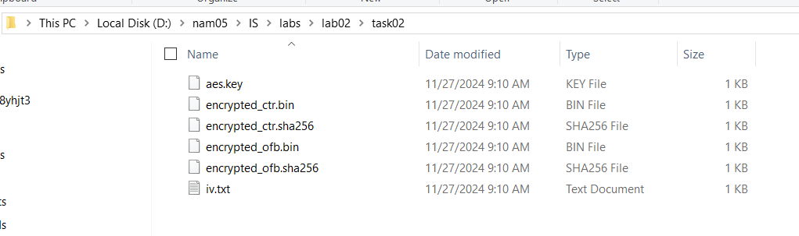

**Answer 1**:
- Demonstrate your ability to send file to PC0 to with message authentication measure.
- Verify the received file for each cipher modes

- After copying the file from WSL to CMD, we have:
    - encrypted_ctr.bin (file encrypted with AES-CTR).
    - encrypted_ctr.sha256 (checksum of encrypted file).
    - encrypted_obf.bin (file encrypted with AES-OBF).
    - encrypted_obf.sha256 (checksum of encrypted file).
    - aes.key (symmetric AES key).
    - iv.txt (Initialization Vector).
- We will calculate the checksum of the encrypted file on PC0 viewing the checksum created on PC2 (from .sha256 file). If the checksum matches, the file was not changed during transmission
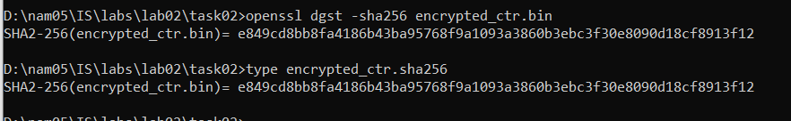
- Before decrypting, we look at the key of the aes.key file and iv.txt file, decrypt the Encrypted_ctr.bin file with AES-CTR, and OBF as the same
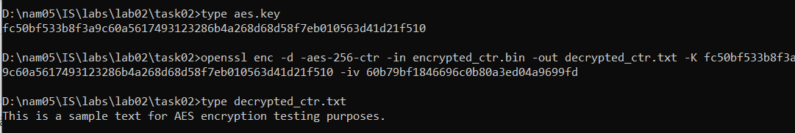
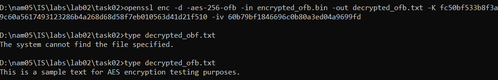

**Evaluation of AES Modes: CTR vs OFB**

| **Criterion**               | **CTR (Counter Mode)**                                                            | **OFB (Output Feedback Mode)**                                               |
|-----------------------------|-----------------------------------------------------------------------------------|-----------------------------------------------------------------------------|
| **Error Propagation**       | Error does not propagate; only the corresponding byte in plaintext is affected.   | Error does not propagate; only the corresponding byte in plaintext is affected. |
| **Adjacent Plaintext Blocks** | Plaintext blocks are independent and do not rely on each other.                  | Plaintext blocks are independent and do not rely on each other.             |

**Question 2**:

**Answer 2**:
- Assume the 6th bit in the ciphered file is corrupted.
- On this situation PC0 is also wsl.Simulate errors on the encrypted file by changing the 6th bit value. This operation needs to be done on both encrypted files (AES-CTR and AES-OFB).
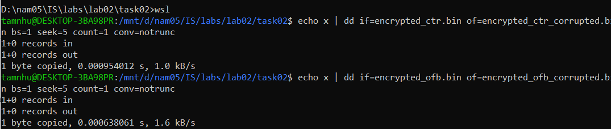

- Then, we will recalculate the checksum of the corrupted file
and we can see the change:
- After:
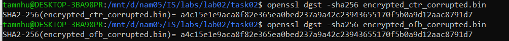
- Before:
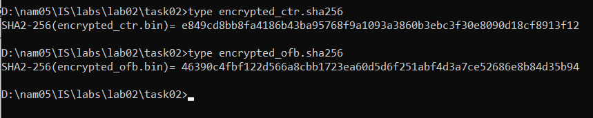
- If the checksum does not match, it confirms the file has been changed.

**Question 3**:
- Decrypt corrupted files on PC0.
- Decoding error CTR and OBF files and we can see the decoding result we get is as follows
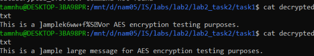
- Comment on both ciphers in terms of error propagation and adjacent plaintext blocks criteria. 
- Conclusion: 
    - Error propagation: Error does not propagate to other bytes in both CTR and OFB.
    - Adjacent Plaintext Blocks: Independent plaintext blocks, not affected by each other.

